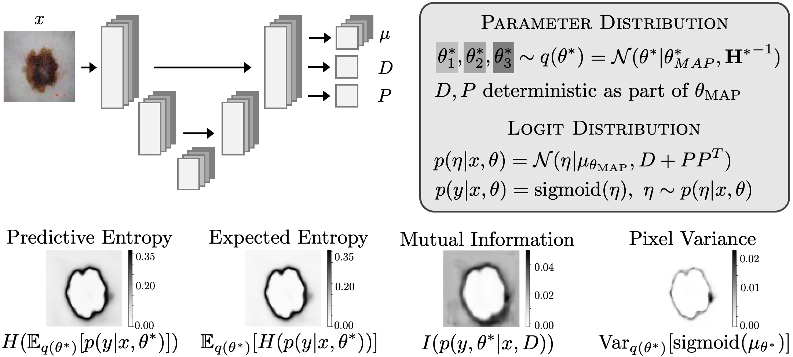

# Laplacian Segmentation Networks Improve Epistemic Uncertainty Quantification

Kilian Zepf*, Selma Wanna*, Marco Miani, Juston Moore, Jes Frellsen, Søren Hauberg, Frederik Warburg, Aasa Feragen (MICCAI 2024)


$^*$ denotes equal contribution

[[Paper on Arxiv]](https://arxiv.org/abs/2303.13123#)


This repository contains an implementation of the proposed model class as well as the benchmarks presented in the paper. The code is based on PyTorch. 

$\qquad$

<p align="center">

</p>

Figure: Model overview Laplacian Segmentation Network - uncertainty measures are calculated by approximating expectations by Monte Carlo-sampling mean networks from the Laplace approximation $q(θ_*)$ and predicting the respective logit distributions $p(η|x,θ)$ for $x$.

## Citation
If our method is helpful for your own research, please consider citing our MICCAI 2024 paper:
```

@misc{zepf2024laplaciansegmentation,
      title={Laplacian Segmentation Networks Improve Epistemic Uncertainty Quantification}, 
      author={Kilian Zepf and Selma Wanna and Marco Miani and Juston Moore and Jes Frellsen and Søren Hauberg and Frederik Warburg and Aasa Feragen},
      year={2024},
      eprint={2303.13123},
      archivePrefix={arXiv},      
      url={https://arxiv.org/abs/2303.13123}, 
}
```